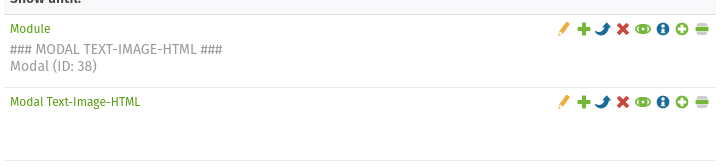
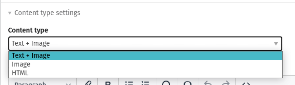
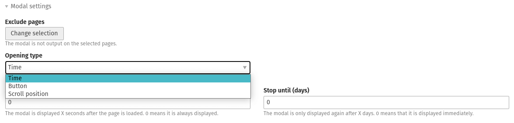

# Contao Modal Bundle


This bundle adds the ability to show a **dialog element** in your Contao website.

It uses the [HTMLDialogElement](https://developer.mozilla.org/en-US/docs/Web/API/HTMLDialogElement) and its `showModal()` and `close()` methods to show and hide the content.

Additional [attributes](https://developer.mozilla.org/en-US/docs/Web/Accessibility/ARIA/Roles/dialog_role) are added in the HTML:
```html
role="dialog"
arialabelledby=""
ariadescribedby=""
```

The element is available both as a **content element** and as a **module**.



---

## Content options

There are three options available for the modal's content.



### Text and Image

Besides a heading, a text (TinyMCE) can also be added. 

Additionally, you have the possibility to select an image with image size.

### Image

Only one image with image size can be selected for the content.

### HTML

Custom HTML content can be inserted for the content.

---

## Opening options

There are three different opening options available.



### Time
You can select an amount of seconds in the back end. 

After the page has been loaded the modal will show up automatically after the selected amount of seconds.

Furthermore, you can select an amount of days for which the user should not see the modal anymore.

### Scroll position

If this option is selected, the modal will show up automatically if its section in the content is reached.

Here, too, you have the option to specify the number of days that the user will not be interrupted afterwards.

### Button

If this option was selected, an additional button is shown in the front end.

Clicking on the button will trigger the modal.

---

## Settings

There is an option **not to display** the modal **on certain pages**.

Furthermore, a link can be stored. If you are on its target page, the modal is also not displayed.
